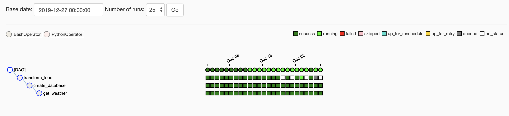
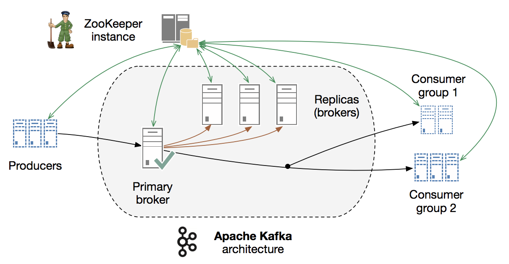

#### Airflow ETL
```bash
#install airflow
#add to . bash_profile
$ export AIRFLOW_HOME=<path_to_airflow_home>

# load data to MySQL with MySQL database, use hook and MySqlOperator
$ pip install airflow[postgres]||[mysql]
```

```bash
#init the metadata db
$airflow initdb
$cp dag.py ~/airflow/dags

$airflow webserver -p 8080
$airflow scheduler
```

<figcaption>

<p style='padding-left: 140px'><i>the data running dag</i></p>
<figcCaption>

<i>airflow main directory structure</i>
```bash
(base) Chloes-MacBook-Pro:airflow chloeji$ tree -d -L 1
.
├── __pycache__
├── dags
├── logs
├── packages
└── tests
```
- use `Flake8` and `Black` to check static code style and code formatter
- use `Github Action` for CI/CD, add `.github/workflows/airflow.yaml`

<hr>

#### Kafka data pipeline (check <a href="https://github.com/Chloejay/streampipe">streampipe</a>)
use <strong>kafka-python</strong> as main framework, along with zookeeper, and other kafka related message queue tool. <br/>
<!-- ``` dir 'config/server.properties' ```  -->

 
<i><small>img source: from tutorial</small></i> 

<h6>get api data into kafka and load to DWH</h6> 

```bash 
# make sure kafka and zookeeper are both running 
$ brew services start zookeeper 
or 
$ bin/zookeeper-server-start.sh config/zookeeper.properties 
$ kafka-server-start /usr/local/etc/kafka/server.properties 
# kafka default is running on port 9092, the zookeeper is on 2181
$ config/server.properties 
#set up multiple partitions 
$ kafka-topics --zookeeper <host>:2181 --create --topic <topic-name> --partitions <number-of-partitions> --replication-factor <number-of-replicas>
# create topic
$ kafka-topics --create --zookeeper localhost:2181 --replication-factor 1 --partitions 1 --topic <any_topic_name>
# check existed topics
$ bin/kafka-topics.sh --list --zookeeper localhost:2181 
# delete topic, just make sure topic default setting is delete.topic.enable= True 
$ bin/kafka-topics.sh --zookeeper localhost:2181 --delete --topic <any_topic_name> 
# init producer as source to load data
$ cd kafka_2.11-1.1.0 
bin/kafka-console-producer.sh --broker-list localhost:9092 --topic <any_topic_name_you_have_created>
# trigger consumer as sink to load data (ingest) 
$ kafka-console-consumer --bootstrap-server localhost:9092 --topic <any_topic_name_you_have_created> --from-beginning
```

install plugin
$ pip install confluent-kafka[avro] 

yml load deprecation issue, see its <a href='https://github.com/yaml/pyyaml/wiki/PyYAML-yaml.load(input)-Deprecation'>repo </a> 

```
echo 'export PYTHONPATH=$PYTHONPATH:./anaconda3/lib/python3.7/' >> .bashrc
$ brew install zlib
$ brew install sqlite
$ export LDFLAGS="${LDFLAGS} -L/usr/local/opt/zlib/lib"
$ export CPPFLAGS="${CPPFLAGS} -I/usr/local/opt/zlib/include"
$ export LDFLAGS="${LDFLAGS} -L/usr/local/opt/sqlite/lib"
$ export CPPFLAGS="${CPPFLAGS} -I/usr/local/opt/sqlite/include"
$ export PKG_CONFIG_PATH="${PKG_CONFIG_PATH} /usr/local/opt/zlib/lib/pkgconfig"
$ export PKG_CONFIG_PATH="${PKG_CONFIG_PATH} /usr/local/opt/sqlite/lib/pkgconfig"
$ pyenv install 3.6.0 
$ pyenv global 3.6.0 
```