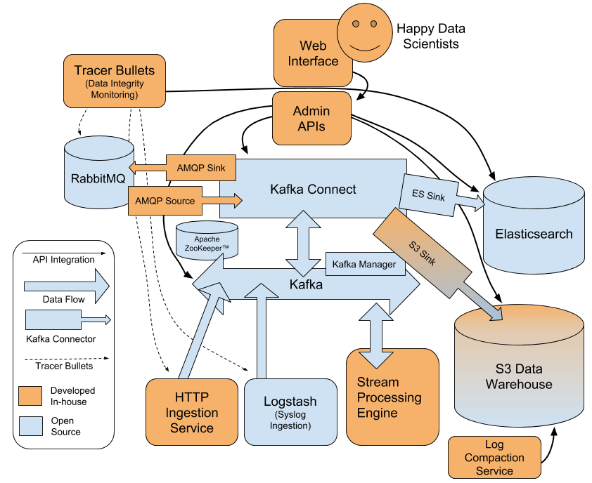

<h4>Kafka data pipeline</h4> 
<h6> after airflow</h6> 
use <strong>kafka-python</strong> as the main learning framework, along with zookeeper, and other kafka related from message tool. Comparing the kafka with the rabbitmq, they both function as the message system. But for the self learning simplicity and demo to understand the whole abstract concept about event streaming, stick to kafka at this stage. <br/> 

<!-- ``` dir 'config/server.properties' ```  -->

 
<i><small>img source: from tutorial</small></i> 

<h6>get api data into the kafka and load to the DWH</h6> 
```bash 
# make sure kafka and zookeeper are both running 
$ kafka-server-start /usr/local/etc/kafka/server.properties 
$ brew services start zookeeper 
or 
$ bin/zookeeper-server-start.sh config/zookeeper.properties 
# the kafka default is running on the port 9092, the zookeeper is on 2181, config on 
$ config/server.properties 
# create the topic
$ kafka-topics --create --zookeeper localhost:2181 --replication-factor 1 --partitions 1 --topic <any_topic_name>
# check existed topics
$ bin/kafka-topics.sh --list --zookeeper localhost:2181 
# of course, delete topic, just make sure topic default setting is delete.topic.enable= True 
$ bin/kafka-topics.sh --zookeeper localhost:2181 --delete --topic <any_topic_name> 
# init the producer as source to load data
$ kafka_2.11-1.1.0 bin/kafka-console-producer.sh --broker-list localhost:9092 --topic <any_topic_name_you_have_created>
# trigger the consumer as the sink to load data to destination DWH
$ kafka-console-consumer --bootstrap-server localhost:9092 --topic <any_topic_name_you_have_created> --from-beginning
```

<i><small>img source: from tutorial</small></i> 

<br/>
TODO: 

connect with DB with JDBC driver 
implement with spark streaming 