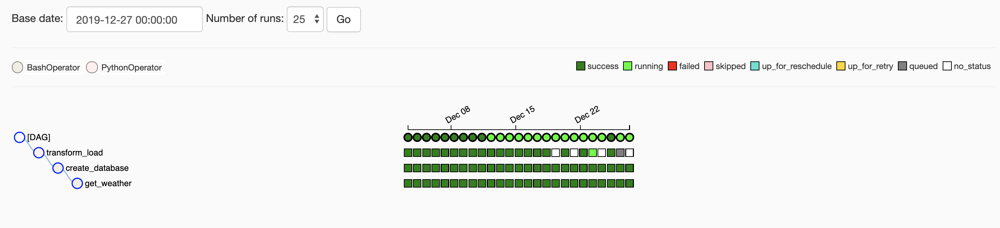

airflow playground 

```bash
#install airflow 
$ export AIRFLOW_HOME=<path_to_airflow_home>
$ pip install airflow[postgres]||[mysql] 
#init the metadata db
$ airflow initdb 
```

```bash
$ airflow webserver -p 8080
$ airflow scheduler
```


<figcaption>

<p style='padding-left: 120px'>the sample data running dag</p>
<figcCaption>

```bash
#note for the scheduler style format 
 ┌─────── minute (0 - 59)
  │ ┌────── hour (0 - 23)
  │ │ ┌───── day of the month (1 - 31)
  │ │ │ ┌───── month (1 - 12)
  │ │ │ │ ┌──── day of the week (0 - 6) (Sunday to Saturday;
  │ │ │ │ │      7 is also Sunday on some systems)
  * * * * * 
0 * * * * = hourly (running on the hour)
0 0 * * * = daily (running at midnight)
0 0 * * 0 = weekly (running at midnight on Sunday)
0 0 1 * * = midnight on the first of every month
 45 23 * * SAT = 23:45 every Saturday 
 0 0 * * MON-FRI = run every weekday at midnight 
 @once     Schedule once and only once.    -
 @hourly   Run once an hour at the beginning of the hour.   0 * * * *
 @daily    Run once a day at midnight             0 0 * * *
 @weekly   Run once a week at midnight on Sunday morning.   0 0 * * 0
 @monthly  Run once a month at midnight on the first day of the month.   0 0 1 * *
 @yearly   Run once a year at midnight on January 1.    0 0 1 1 *
 ```
 
 #### how to add the data incrementally or in partitions
 use date as the unit, to load the data in the daily base, so can reach the real time data performance, don't need to load the whole dataset each time, we run something base on the history<br/>

 backfill is to fix the past hole in the dataset<br/>

use operator to communicate with the remote system via hooks, for the task such as loading data to database, running a command in a remote environment and submitting a Spark job to a YARN cluster.